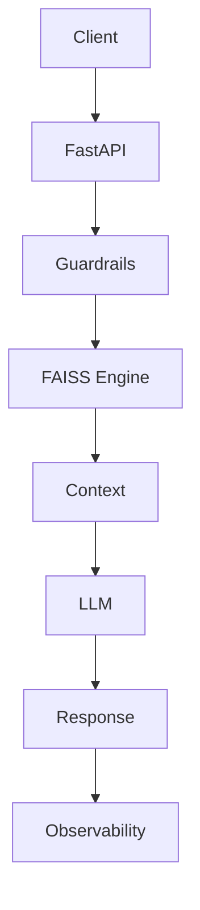

# 🤖 Documind — AI Agent Core (Zero-Hallucination System)

> A production-style AI backend that enforces strict guardrails, latency tracking, and safe fallback logic for real-world AI agents.

---

## 🚀 Why This Exists

AI systems in production fail due to:

* Hallucinated responses
* High latency
* Unsafe outputs
* Lack of observability

This system focuses on **reliability over raw intelligence**.

---

## 🏗️ Architecture



---

## 🔥 Core Capabilities

### ✅ Zero-Hallucination Guardrails

* Reject unsafe queries
* Restrict answers to known context
* Enforce fallback when uncertain

---

### ✅ Latency Observability

Tracks:

* API latency
* LLM response time
* End-to-end processing

---

### ✅ Safe Fallback System

If confidence is low:

```json
{
  "fallback": "Escalate to human agent"
}
```

---

### ✅ AI Agent Simulation

Designed for:

* AI receptionist
* AI sales assistant
* CRM-integrated responses

---

## 📊 API

```http
GET /query?q=customer_query
```

---

## ⚖️ Design Decisions

| Decision         | Reason               |
| ---------------- | -------------------- |
| RAG approach     | Avoids hallucination |
| Guardrails layer | Ensures safety       |
| Observability    | Debug AI failures    |
| FAISS            | Fast retrieval       |

---

## 🚧 What Breaks in Production?

* Missing context → wrong answers
* LLM latency spikes
* Unsafe user input
* Model inconsistency

This system prioritizes **safety and reliability** over raw output.

---

## 📈 Scaling Strategy

* Stateless API scaling
* Vector DB sharding
* Response caching

---

## 🌍 Real-World Mapping

This mirrors AI agents used in:

* Call centers
* Sales automation
* Customer support

---

## 👨‍💻 Author

Harsh Raj
AI Systems | Backend Engineering | LLM Infrastructure
